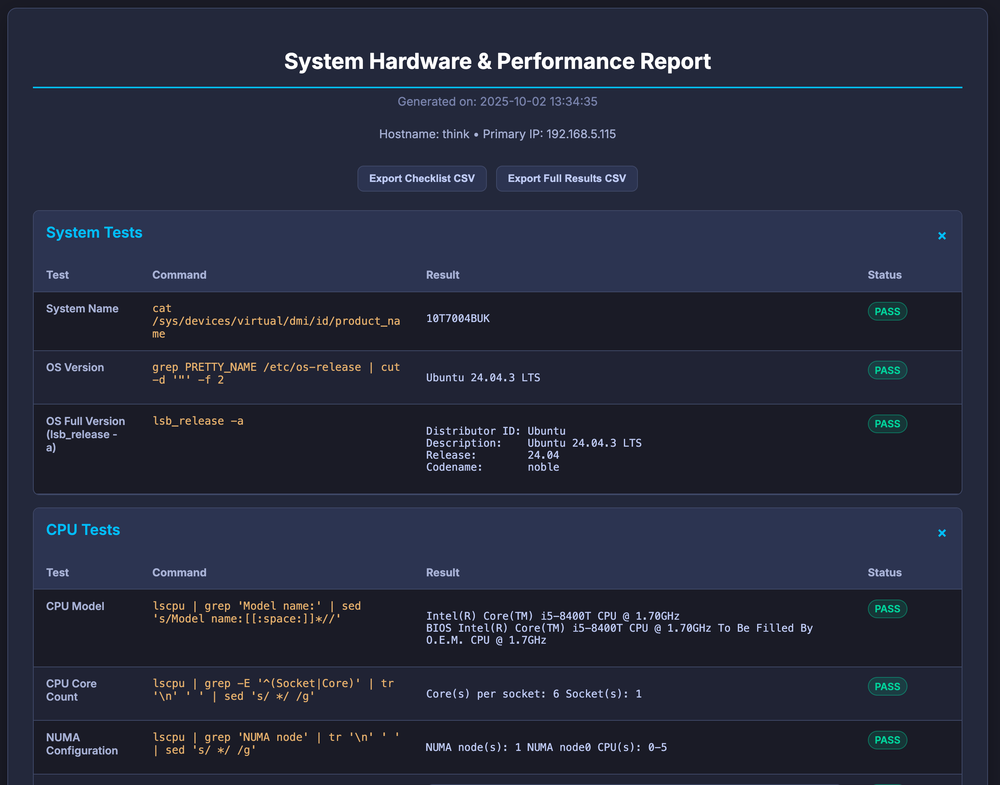
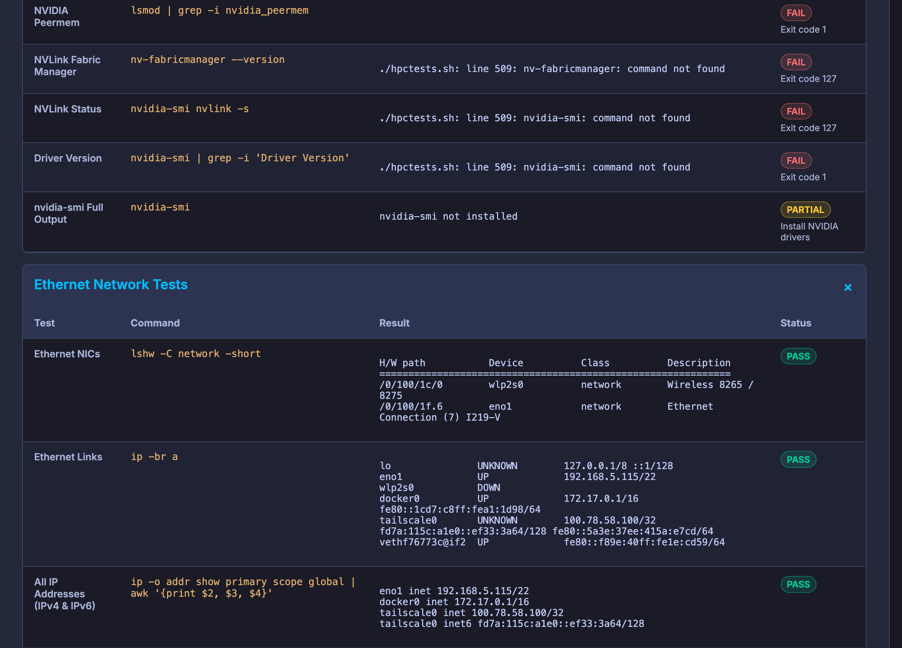
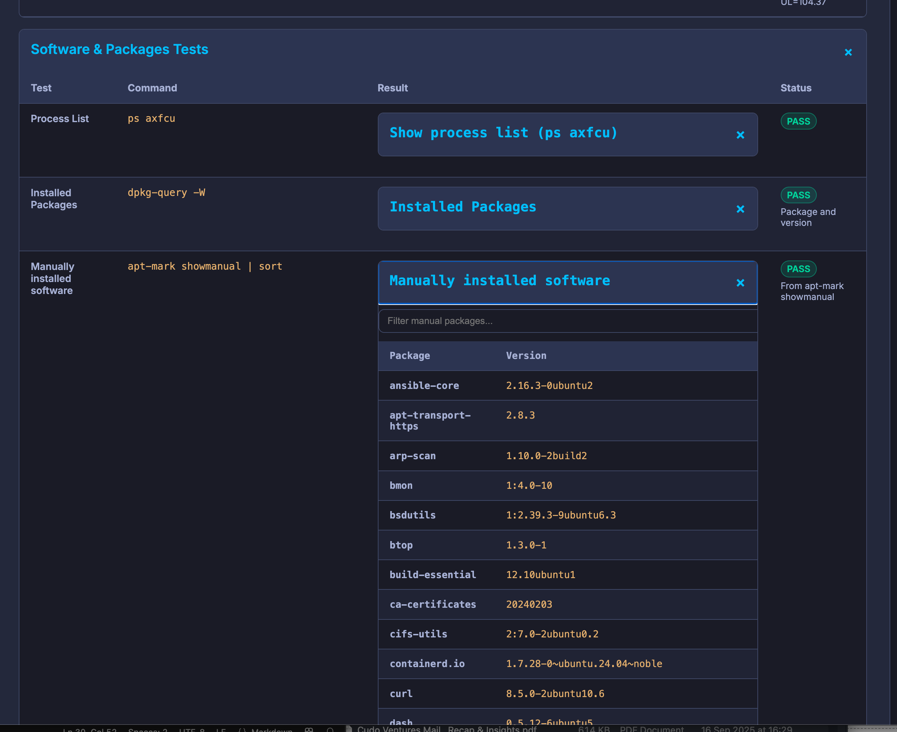

# System Hardware & Performance Test Script

A comprehensive bash script designed to automate the auditing and performance testing of high-performance computing (HPC) nodes. It runs a series of hardware and software checks and compiles the results into a clean, self-contained, and professional HTML report.


## Features

-   **Automated System Checks**: Gathers detailed information on the OS, CPU, RAM, NVMe storage, GPUs, Ethernet, and InfiniBand configurations.
    
-   **Self-Contained HTML Reports**: Generates a single, beautifully styled HTML file with collapsible sections for easy navigation. No external dependencies are needed to view the report.
    
-   **Intelligent Dependency Handling**: Automatically detects and offers to install missing standard packages. For complex drivers (NVIDIA, Mellanox), it provides clear manual installation instructions.
    
-   **NVIDIA Driver Support**: Automatic detection and installation of NVIDIA drivers with post-reboot recovery. Includes Fabric Manager integration and NVIDIA Container Toolkit setup for Docker GPU access.
    
-   **Optional Performance Benchmarks**: Includes long-running HPL and GPU-burn benchmarks via Docker with real-time console output, with interactive prompts to run or skip them.
    
-   **Collapsible Report Sections**: Detailed output sections (HPL, IB Fabric, lscpu, nvidia-smi) are displayed as expandable/collapsible elements in the HTML report for better readability.
    
-   **Automated Mode**: A `--nocheck` flag allows the script to run non-interactively, skipping all prompts, making it ideal for automated CI/CD pipelines or batch testing.

## Screenshots



    

## Sample Report

The script generates an HTML report with a dark, modern theme. Here is a sample of what the interface looks like:

## Requirements

-   **Operating System**: Ubuntu 24.04 LTS (or a similar Debian-based distribution).
    
-   **Privileges**: The script must be run as `root` or with `sudo` privileges to access hardware information.
    

## Installation

1.  **Save the script**: Save the script content to a file named `hpctests.sh`.
    
2.  **Make it executable**: Open your terminal and run the following command:
    
    ```
    chmod +x hpctests.sh
    
    ```
    

## Dependencies

The script will check for required software and assist with installation.

#### 1. Standard Packages (Automatic Installation)

If the following tools are missing, the script will prompt you to install them automatically using `apt`:

-   `lshw`
    
-   `ethtool`
    
-   `ipmitool`
    
-   `ibutils` (for InfiniBand tools like `ibstatus`, `ibdev2netdev`, `iblinkinfo`)
    
-   `infiniband-diags` (InfiniBand diagnostic utilities)
    
-   `rdma-core` (RDMA core libraries)
    
-   `speedtest-cli` (network bandwidth testing)
    
-   `docker-ce` (only if you choose to run the performance benchmarks)
    

#### 2. Complex Drivers (Manual Installation)

For specialized HPC drivers, the script will detect if they are missing and provide instructions. Manual installation is required for:

-   **NVIDIA Drivers (`nvidia-smi`)**:
    
    -   **Automatic Detection**: The script automatically detects and reports NVIDIA driver, CUDA toolkit, and Fabric Manager versions if installed.
        
    -   **Automatic Installation**: If not found, the script offers to install NVIDIA drivers via `sudo ubuntu-drivers autoinstall` and will install `nvidia-driver-${NVIDIA_DRIVER_VERSION}-server` and `nvidia-fabricmanager-${NVIDIA_FABRICMANAGER_VERSION}` (default version: 580).
        
    -   **Post-Reboot Recovery**: If installation requires a reboot, the script creates a marker file and verifies Fabric Manager is running on next execution.
        
    -   **Configuration**: Supports environment variables `NVIDIA_DRIVER_VERSION` and `NVIDIA_FABRICMANAGER_VERSION` to override default versions.
        
-   **NVIDIA Container Toolkit**:
    
    -   **Automatic Setup**: After Docker installation/detection, the script automatically sets up NVIDIA Container Toolkit to enable GPU access in Docker containers.
        
    -   **Components**: Installs GPG keys, APT repository, nvidia-container-toolkit package, and configures Docker runtime.
        
-   **Mellanox OFED Drivers (`ofed_info`)**:
    
    -   **Method**: These must be downloaded directly from the NVIDIA Networking website (formerly Mellanox). Follow the installation guide included with the driver package.
        

## Usage

You can run the script with the following flags to control behavior.

- Interactive (prompts):
  ```bash path=null start=null
  sudo ./hpctests.sh
  ```

- Headless (auto-yes to prompts; installs allowed):
  ```bash path=null start=null
  sudo ./hpctests.sh --headless
  ```

- Skip Docker benchmarks:
  ```bash path=null start=null
  sudo ./hpctests.sh --noburn
  ```

- Do not install anything (skip installs and skip benchmarks), but still run tests and generate report:
  ```bash path=null start=null
  sudo ./hpctests.sh --noinstall
  ```

- Legacy non-interactive mode (skips dependency prompts and confirmations; runs all tests):
  ```bash path=null start=null
  sudo ./hpctests.sh --nocheck
  ```

- Show help:
  ```bash path=null start=null
  sudo ./hpctests.sh --help
  ```

### Flag interactions
- --headless may be combined with --noburn to run tests non-interactively while skipping benchmarks.
- --noinstall implies no Docker installation and benchmarks are skipped.

### Environment Variables

Configure script behavior using environment variables:

- `NVIDIA_DRIVER_VERSION`: Version of nvidia-driver to install (default: `580`)
  ```bash
  NVIDIA_DRIVER_VERSION=545 sudo ./hpctests.sh
  ```

- `NVIDIA_FABRICMANAGER_VERSION`: Version of nvidia-fabricmanager to install (default: `580`)
  ```bash
  NVIDIA_FABRICMANAGER_VERSION=545 sudo ./hpctests.sh
  ```

- `MIN_LINK_SPEED_MBPS`: Minimum Ethernet link speed threshold (default: `0`, disabled)
  ```bash
  MIN_LINK_SPEED_MBPS=10000 sudo ./hpctests.sh
  ```

- `MIN_DOWNLOAD_MBPS` / `MIN_UPLOAD_MBPS`: Network bandwidth test thresholds (default: `0`, disabled)
  ```bash
  MIN_DOWNLOAD_MBPS=1000 MIN_UPLOAD_MBPS=1000 sudo ./hpctests.sh
  ```

- `SPEEDTEST_SERVER_NEARBY` / `SPEEDTEST_SERVER_EU`: Pin specific Speedtest servers by ID
  ```bash
  SPEEDTEST_SERVER_NEARBY=1234 SPEEDTEST_SERVER_EU=5678 sudo ./hpctests.sh
  ```

## Tests Run and Expected Output (overview)

- System
  - What: DMI product name, OS version (short and full)
  - Expect: Strings identifying platform and distribution
- CPU
  - What: Model, core/socket topology, NUMA info, full lscpu output (collapsible)
  - Expect: Vendor/model line, counts match hardware; NUMA lines present on NUMA systems
- RAM
  - What: Total memory (free -h)
  - Expect: Human-readable total (e.g., 251G)
- NVMe Storage
  - What: lsblk overview with device chips; filesystem usage (df -h)
  - Expect: Disks listed as chips; lsblk table; mounted filesystems in df
- GPU
  - What: Names, VRAM, peermem module, Fabric Manager, NVLink status, driver version; full nvidia-smi (collapsible)
  - Expect: PASS when nvidia-smi is available; driver/CUDA/Fabric Manager versions shown; automatic installation offered if not present
- Ethernet Network
  - What: NIC inventory, IPs, per-interface link speeds vs threshold, bond details if present
  - Expect: Link speeds visible; PASS/FAIL depends on MIN_LINK_SPEED_MBPS
- InfiniBand Network
  - What: Rate/status, link layer info, fabric switch topology (collapsible)
  - Expect: Outputs if IB stack present; infiniband-diags and rdma-core automatically installed; fabric topology displayed in collapsible view
- Security & Accounts
  - What: MOTD files, SSH key metadata (no secrets), /etc/passwd, shadow status summary, home directories
  - Expect: Collapsible sections with sanitized content; no secrets revealed
- Network Speed Tests
  - What: Two runs via speedtest-cli (Nearby, Europe)
  - Expect: Download/Upload values; PASS/FAIL/Partial depends on thresholds and availability
- Software & Packages
  - What: Process list; Installed packages; Manually installed packages
  - Expect: Searchable tables; may be partial on minimal systems
- Services & Mounts
  - What: sshd status, IPMI access, NFS mounts
  - Expect: PASS where services/mounts are present
- High-Performance Benchmarks (Docker)
  - What: HPL single-node; GPU-burn with full real-time console output
  - Expect: Run only if Docker present/installed and not skipped by --noburn/--noinstall; NVIDIA Container Toolkit auto-configured; HPL output shown in collapsible view in report; both tests display output to console during execution

## Using the HTML report
- Single, self-contained HTML file with collapsible sections per category
- Two export buttons at the top:
  - Export Checklist CSV: condensed checklist with statuses
  - Export Full Results CSV: full table content
- Status badges:
  - PASS: Green
  - PARTIAL: Yellow
  - FAIL: Red
- Notes field explains why a test is partial/fail and any thresholds used

## Running remotely over SSH and saving the HTML locally

Example: run on a remote HPC node, then copy the newest report back to your local machine.

```bash path=null start=null
# 1) Run remotely (auto-yes for prompts, skip benchmarks)
ssh user@remote-host 'cd ~/code/hpctest && sudo ./hpctests.sh --headless --noburn'

# 2) Find latest report on remote and copy it back
LATEST=$(ssh user@remote-host 'ls -t system_test_report_*.html 2>/dev/null | head -n1')
scp user@remote-host:"$LATEST" ./

# 3) Open locally (macOS example)
open "$(basename "$LATEST")"
```

Notes:
- Ensure the script resides on the remote host and is executable (chmod +x hpctests.sh).
- You can combine flags as needed (e.g., --noinstall to avoid any package installs).

## Output

The script generates a single HTML file in the same directory, named with a timestamp (e.g., `system_test_report_2025-09-12_15-30-00.html`). This file is self-contained and can be opened in any modern web browser to view the full report.
